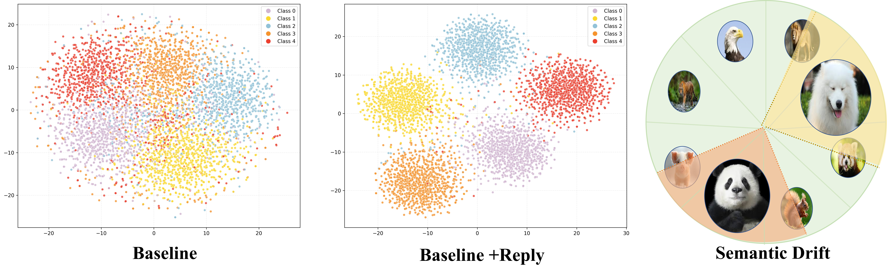
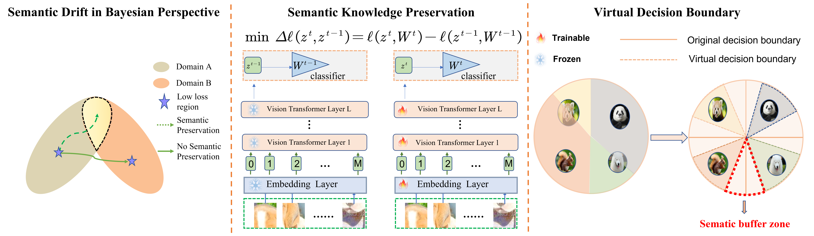

SVDB: Semantic-Preserving Virtual Decision Boundary Mitigate Semantic Drift in Continual Test-Time Adaptation

## This is the official project repository for SVDB: Semantic-Preserving Virtual Decision Boundary Mitigate Semantic Drift in Continual Test-Time Adaptation. This repository is built based on [SAR 🔗](https://github.com/mr-eggplant/SAR) and  [DCT (MM 2024) 🔗](https://github.com/yushuntang/DCT).
## 🚀 Method Integration: Building Upon SOTA Foundations
**Based on their work**, we have integrated **cutting-edge** approaches:
- [**MAE** (CVPR 2024) 🔗](https://github.com/RanXu2000/continual-mae?tab=readme-ov-file)  
- [**CoTTA** (CVPR 2022) 🔗](https://github.com/RanXu2000/continual-mae?tab=readme-ov-file)  
- [**ViDA** (ICLR 2024) 🔗](https://github.com/RanXu2000/continual-mae?tab=readme-ov-file)  
- [**BECoTTA** (ICML 2024) 🔗](https://github.com/RanXu2000/continual-mae?tab=readme-ov-file)


### 🔍 More Experiments: Forgetting resulting Semantic Drift Analysis

<p align="center">

</p>

**Key Findings:**
Using ViDA as baseline, we randomly selected semantic features (CLS tokens from the final layer) for 5 classes in ImageNet-C to generate t-SNE visualizations. The semantic drift phenomenon is significantly mitigated using ViDA+Reply, inspired by Reshaping. We reveal two critical issues:
1. **Semantic Confusion**: Features cluster near decision boundaries
2. **Semantic Overwriting**: Features cross boundaries, invading other classes' semantic space


### 🔍 Comparisons with state-of-the-art methods on ImageNet-C (level 5) with BATCH SIZE=1 Accuracy (%).

| Method | REF         | gaussian | shot | impulse | defocus | glass | motion | zoom | snow | frost | fog  | brightness | contrast | elastic | pixelate | jpeg | Mean↑ |
|--------|-------------|----------|------|---------|---------|-------|--------|------|------|-------|------|------------|----------|---------|----------|------|-------|
| SVDB   | This work   | 63.4     | 65.7 | 64.7    | 57.1    | 63.2  | 66.3   | 28.6 | 71.8 | 70.8  | 75.3 | 78.4       | 43.8     | 72.1    | 75.8     | 73.2 | 64.7  |
| SAR    | ICLR 2023   | 57.7     | 58.5 | 58.9    | 51.4    | 54.4  | 61.5   | 59.1 | 64.8 | 64.9  | 67.6 | 78.1       | 2.0      | 68.1    | 67.9     | 66.0 | 58.7  |
| TENT   | ICLR 2020   | 56.9     | 58.1 | 58.4    | 45.0    | 50.5  | 58.4   | 50.0 | 51.9 | 56.3  | 58.7 | 78.2       | 11.4     | 59.5    | 70.1     | 71.4 | 55.7  |
| DPAL   | ECCV 2024   | 0.3      | 0.1  | 0.1     | 0.1     | 0.1   | 0.1    | 0.1  | 0.1  | 0.1   | 0.1  | 0.1        | 0.1      | 0.1     | 0.1      | 0.1  | 0.1   |
| DCT    | MM 2024     | 0.3      | 0.1  | 0.1     | 0.1     | 0.1   | 0.1    | 0.1  | 0.1  | 0.1   | 0.1  | 0.1        | 0.1      | 0.1     | 0.1      | 0.1  | 0.1   |


## SVDB Framework
<p align="center">

</p>

**Installation**:
This repository contains code for evaluation on ImageNet-C,CIFAR10-C,CIFAR100-C, ImageNet-R, VisDA-2021, ACDC with ViT.
For CIFAR10-C and CIFAR100-C, the pre-trained ViT-B model weights are from [MAE (CVPR 2024) 🔗](https://github.com/RanXu2000/continual-mae?tab=readme-ov-file)
For ImageNet-C,ImageNet-R and  VisDA-2021, the pre-trained ViT-B model weights are from timm .

**Dataset Download**:

[CIFAR100-C 🔗](https://zenodo.org/records/3555552)
[CIFAR10-C 🔗](https://zenodo.org/records/2535967)
[ImageNet-C 🔗](https://zenodo.org/records/2235448#.Yj2RO_co_mF)


**Details of ours code**:
In ./models/svdb\_transformer.py, we implemented Semantic Knowledge Preservation. In vdb\_loss.py, we implemented Virtual Decision Boundary.

**Usage in ImageNet-C**:
```
python main.py --method svdb --test_batch_size 64 --lr 1e-3  --num_classes 1000 --device 0  --data_corruption XX
python main.py --method dct --test_batch_size 64 --lr 1e-3  --num_classes 1000 --device 0  --data_corruption XX
python main.py --method dpal --test_batch_size 64 --lr 1e-3  --num_classes 1000 --device 0  --data_corruption XX
python main.py --method sar --test_batch_size 64 --lr 1e-3  --num_classes 1000 --device 0  --data_corruption XX
python main.py --method tent --test_batch_size 64 --lr 1e-3  --num_classes 1000 --device 0  --data_corruption XX
python main.py --method cotta --test_batch_size 64 --lr 1e-4  --num_classes 1000 --device 0  --data_corruption XX
```
**Usage in ImageNet-C BATCH SIZE=1**:
```
python main.py --method svdb --test_batch_size 1 --lr 1e-4 --num_classes 1000 --device 0  --data_corruption XX
python main.py --method dct --test_batch_size 1 --lr 1e-3  --num_classes 1000 --device 0  --data_corruption XX
python main.py --method dpal --test_batch_size 1 --lr 1e-3  --num_classes 1000 --device 0  --data_corruption XX
python main.py --method sar --test_batch_size 1 --lr 1e-3  --num_classes 1000 --device 0  --data_corruption XX
python main.py --method tent --test_batch_size 1 --lr 1e-3  --num_classes 1000 --device 0  --data_corruption XX
python main.py --method cotta --test_batch_size 1 --lr 1e-4  --num_classes 1000 --device 0  --data_corruption XX
```


**Usage in CIFAR10-C and CIFAR100-C**:
```
python cifar_main.py --method svdb --test_batch_size 32 --lr 1e-3 --num_classes 10 --device 0
python cifar_main.py --method svdb --test_batch_size 32 --lr 1e-3  --num_classes 100 --device 0

python cifar_main.py --method dct --test_batch_size 32 --lr 1e-3  --num_classes 10 --device 0
python cifar_main.py --method dct --test_batch_size 32 --lr 1e-3  --num_classes 100 --device 0

python cifar_main.py --method dpal --test_batch_size 32 --lr 1e-3  --num_classes 10 --device 0
python cifar_main.py --method dpal --test_batch_size 32 --lr 1e-3  --num_classes 100 --device 0

python cifar_main.py --method sar --test_batch_size 32 --lr 1e-3  --num_classes 10 --device 0
python cifar_main.py --method sar --test_batch_size 32 --lr 1e-3  --num_classes 100 --device 0

python cifar_main.py --method tent --test_batch_size 32 --lr 1e-3  --num_classes 10 --device 0
python cifar_main.py --method tent --test_batch_size 32 --lr 1e-3  --num_classes 100 --device 0

python cifar_main.py --method cotta --test_batch_size 32 --lr 1e-4  --num_classes 10 --device 0
python cifar_main.py --method cotta --test_batch_size 32 --lr 1e-4  --num_classes 100 --device 0
```

## Acknowledgment
The code is inspired by the [DCT (MM 2024) 🔗](https://github.com/yushuntang/DCT) and [SAR (ICLR 2023) 🔗](https://github.com/mr-eggplant/SAR).
